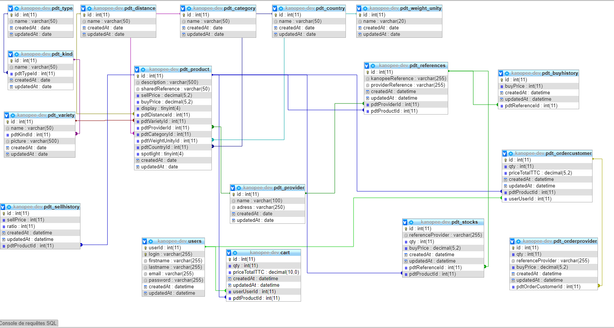

# Description du projet Kanopee

**Kanopee** est une plateforme de e-commerce qui permet à des individus de commander des fruits et légumes. Ces derniers peuvent être issus d'une agriculture locale et raisonnée cultivés par des Kulteurs ou des fournisseurs divers.

## Pour commencer

Pour lancer le projet, commencez par récupérer le dépôt ici : https://gitlab.com/akeroskanope/kcp1

### Pré-requis

Des outils sont nécessaires pour utiliser le projet :

- Un éditeur de texte type [Visual Studio Code](https://code.visualstudio.com/)
- Un environnement [Node](https://nodejs.org/)
- Un environnement [MySQL](https://www.mysql.com/)
- Un gestionnaire de paquet type [Yarn](https://yarnpkg.com/) ou [npm](https://www.npmjs.com/)

### Installation
Pour installer le projet, il faut installer l'ensemble des modules nécessaires avec la commande suivante :
```
yarn install
``` 
### Démarrage

Pour lancer le projet, il faut éxecuter la commande suivante:

```
yarn dev
```
## Architecture

Le projet a été réalisé avec:

* [Lerna](https://lerna.js.org/) - Outil de gestion de dépots multi-packages
* [NuxtJS](https://fr.nuxtjs.org/) - Framework progressif [VueJS](https://vuejs.org/)
* [Vuetify](https://vuetifyjs.com/) - Framework material design
* [Feathers](https://feathersjs.com/) - Framework de communication en temps réel
* [Sequelize](https://sequelize.org/) - Gestionnaire d'objet-relationnel

## Détail des vues

L'architecture du site se présente en 3 grandes parties :

* **Vue vitrine** : accessible par le grand public
* **Vue Konsommateur** : accessible à un utilisateur qui a créé un compte. C'est ici qu'il peut faire son panier et consulter ses commandes
* **Vue Administrateur** : accessible aux administrateurs et Kulteurs pour maintenir la base de données (produits, fournisseurs, commandes...)

## Versions

**Dernière version stable :** 1.0

**Dernière version :** 1.0.0-beta.0

[_Liste des versions_](https://gitlab.com/akeroskanope/kcp1/-/tags)

## Auteurs

Ce programme a été réalisé par [**Akeros**](https://www.akeros.com)

# Base de données

Elle est créée avec Mysql

## Vue relationnelle



Ci-dessous la description des tables et leur utilisation:

## Tables détaillées

### pdt_type

Description : un produit possède un type.

Utilisation : elle est destinée à être figée et utilisée dans le table pdt_kind.

Exemple: fruit

### pdt_kind

Description : un produit possède un genre.

Utilisation : elle est destinée à être figée et utilisée dans le table pdt_variety.

Exemple: pomme

### pdt_variety

Description : un produit possède une variété.

Utilisation : elle pourra évoluée en fonction de nouveaux produits.

Exemple: gala

### pdt_distance

Description : un produit possède une distance.

Utilisation : elle est destinée à être figée et utilisée dans le table pdt_product.
Elle permet d'informer le consommateur sur la distance qui les sépare du fournisseur et si le produit est BIO.

Exemple: 0km

### pdt_category

Description : un produit possède une catégorie, c'ets à dire un calibre.

Utilisation : elle est destinée à être figée et utilisée dans le table pdt_product.

Exemple: I

### pdt_country

Description : un produit possède une origine.

Utilisation : elle est destinée à être figée et utilisée dans le table pdt_product.

Exemple: France.

### pdt_weight_unity

Description : un produit possède une unité.

Utilisation : elle est destinée à être figée et utilisée dans le table pdt_product.

Exemple: KG.

### pdt_product

Description : un produit possède une variété qui possède un genre et qui possède un type. 
Il possède également une distance, une unité, une catégorie et une origine.
Lorsqu'un produit est créé, il obtient une référence issue de sa variété ainsi que des autres attributs présents dans la table.
La référence se construit selon : COUNTRY_KIND_VARIETY_UNITY_CATEGORY_DISTANCE

Utilisation : ils sont utilisés pour être affichés dans le site.
ils sont utilisés pour lier des fournisseurs et créer des références produits par fournisseurs dans la table pdt_references lors de l'import du fichier excel.
ils sont utilisés pour le panier et l'achat par le consommateur.
ils sont utilisés dans la gestion des commandes, c'est la première étape qui consiste à dupliquer le panier une fois payé.

Exemple: FR_POM_GAL_KG_I_0 pour une pomme Gala catégorie I vendu au kilo d'origine France avec 0km.

### pdt_provider

Description : un fournisseur avec ses informations utiles.

Utilisation : il est utilisé dans la table pdt_references lorsqu'une reférence Kanopee est liée à une référence kanopeeFournisseur.

Exemple: Pronadis.

### pdt_references

Description : une référence existante chez le fournisseur associée à une référence Kanopee fournisseur.

Utilisation : il est utilisé dans la gestion des stocks.
il est utilisé dans la gestion des prix d'achat.
il est utilisé dans la gestion des commandes

Exemple: FR_POM_GAL_KG_I_0_PRO pour une pomme Gala catégorie I vendu au kilo d'origine France avec 0km par le fournisseur Pronadis.

### pdt_buyhistory

Description : un historique des prix d'achat par référence produit fournisseur.

Utilisation : il est utilisé dans la table pdt_references lorsqu'une reférence Kanopee est liée à une référence kanopeeFournisseur.

Exemple: 2€99.

### pdt_sellhistory

### pdt_users

### pdt_cart

### pdt_stocks

### pdt_ordercustomer

### pdt_orderprovider